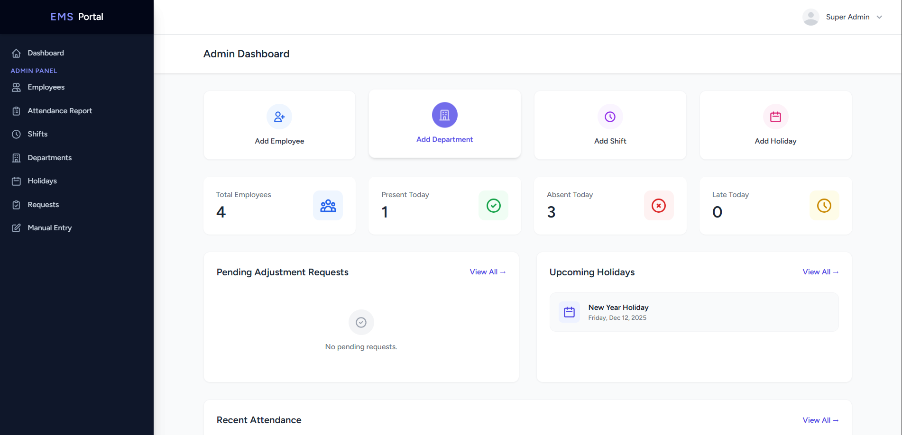
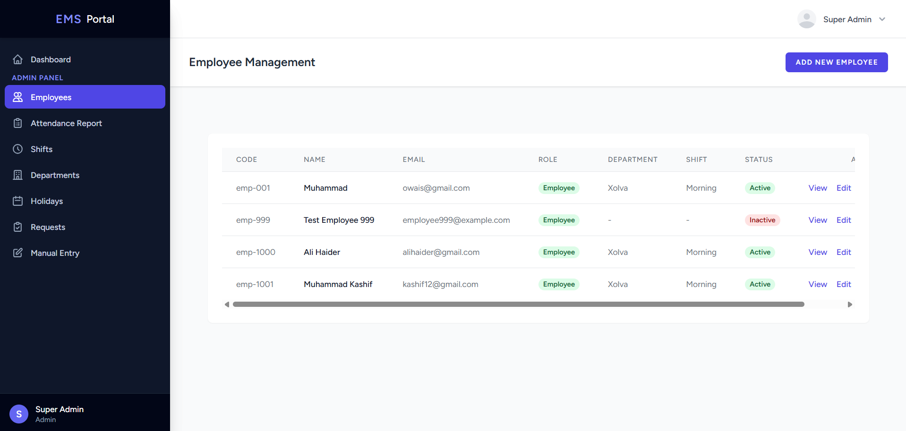
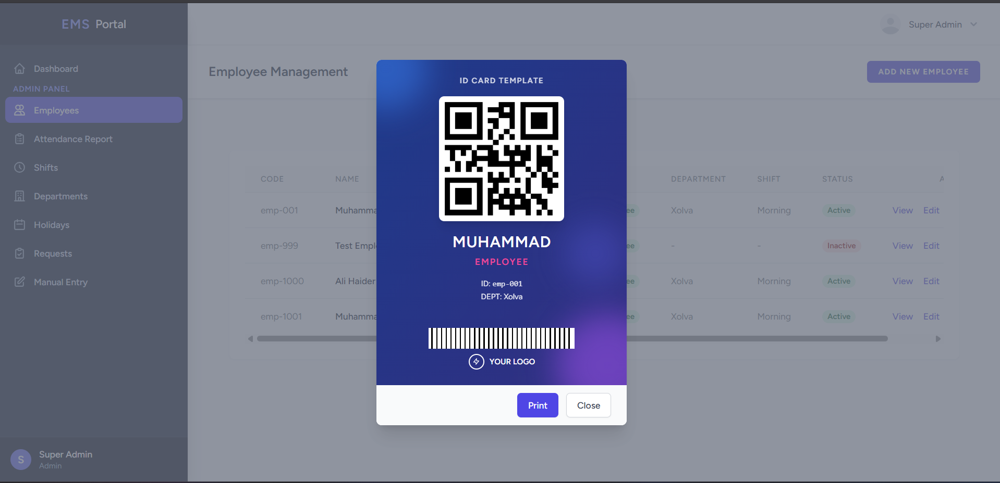

# 🏢 Employee Management System (EMS)


<p align="center">
    <a href="https://laravel.com"></a>
    <a href="https://php.net"></a>
    <a href="https://tailwindcss.com"></a>
    <a href="https://mysql.com"></a>
</p>

<p align="center">
    A comprehensive, modern, and efficient <strong>Employee Management System</strong> built with Laravel. Designed to streamline HR operations, attendance tracking, and employee administration with a focus on user experience and automation.
</p>

---

## 🚀 Key Features

### 👨‍💼 Admin Panel
-   **Interactive Dashboard**: Real-time statistics, attendance charts, and system overview.
-   **Employee Management**: Full CRUD operations for employees, including role assignment and profile management.
-   **Department & Shift Management**: Organize your workforce with dynamic departments and shift schedules.
-   **Holiday Management**: Configure company holidays and off-days.
-   **Attendance Reports**: Detailed logs of employee check-ins, check-outs, and working hours.
-   **Manual Attendance**: Ability to manually mark attendance for employees if needed.
-   **Employee Card Generation**: Generate and print professional employee ID cards with unique QR codes.

### 👨‍💻 Employee Panel
-   **Personal Dashboard**: View personal attendance stats, working hours, and monthly overview.
-   **Attendance History**: Access detailed logs of past attendance records.
-   **Profile Management**: Update personal details and view assigned shifts/departments.

### 📱 Smart Attendance System
-   **QR Code Scanning**: 
    -   **Global Scanner**: Admin can scan employee cards from *any* page in the admin panel.
    -   **Public Scanner**: Dedicated public route (`/scan-qr`) for kiosk mode – allows continuous scanning without login.
-   **Real-time Feedback**: Instant visual and audio feedback for successful check-ins/check-outs.
-   **Smart Logic**: Automatically handles Check-in vs. Check-out based on the employee's current status.
-   **Timezone Support**: Fully configured for **Asia/Karachi (UTC+5)**.

---

## 🛠️ Tech Stack

-   **Backend**: Laravel 11 (PHP Framework)
-   **Frontend**: Blade Templates, Tailwind CSS, Alpine.js
-   **Database**: MySQL
-   **Charts**: ApexCharts.js
-   **Authentication**: Laravel Breeze / Custom Middleware

---

## 📸 Screenshots

| Admin Dashboard | Employee List |
|:---:|:---:|
|  |  |

| Employee Card |
|:---:|
|  |

---

## ⚙️ Installation & Setup

Follow these steps to set up the project locally:

1.  **Clone the Repository**
    ```bash
    git clone https://github.com/yourusername/employee-management-system.git
    cd employee-management-system
    ```

2.  **Install Dependencies**
    ```bash
    composer install
    npm install
    ```

3.  **Environment Configuration**
    ```bash
    cp .env.example .env
    php artisan key:generate
    ```
    *Configure your database credentials in the `.env` file.*

4.  **Run Migrations & Seeders**
    ```bash
    php artisan migrate --seed
    ```

5.  **Build Assets**
    ```bash
    npm run build
    ```

6.  **Start the Server**
    ```bash
    php artisan serve
    ```

---

## 🔐 Usage

### Default Credentials (Seeder)

-   **Admin Account**
    -   Email: `admin@example.com`
    -   Password: `password`

-   **Employee Account**
    -   Email: `employee@example.com`
    -   Password: `password`

### QR Scanner Usage
1.  Navigate to `/scan-qr` (or use the Global Scanner in Admin Panel).
2.  Ensure the input field is focused (click anywhere on the page).
3.  Scan the Employee QR Card.
4.  The system will automatically mark Check-in or Check-out.

---

## 🤝 Contributing

Contributions are welcome! Please follow these steps:
1.  Fork the repository.
2.  Create a new branch (`git checkout -b feature/YourFeature`).
3.  Commit your changes (`git commit -m 'Add some feature'`).
4.  Push to the branch (`git push origin feature/YourFeature`).
5.  Open a Pull Request.

---

## 📄 License

This project is open-sourced software licensed under the [MIT license](https://opensource.org/licenses/MIT).

---

<p align="center">
    Made with ❤️ by <a href="https://github.com/yourusername">Your Name</a>
</p>
